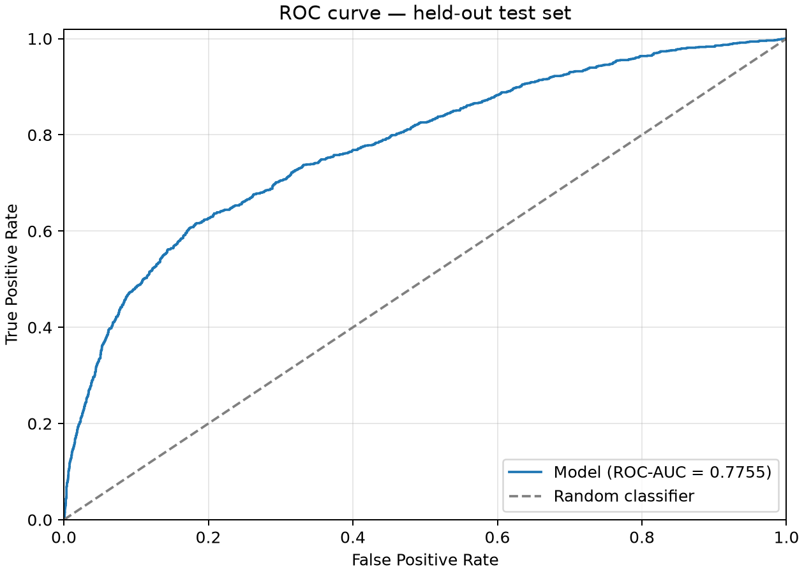

# Качество бинарной классификации

Отложенная тестовая выборка: 6000 записей. Положительный класс: default = 1 (кредитный дефолт).

ROC-AUC рассчитан по вероятности положительного класса. Precision, Recall и F1-Score рассчитаны по предсказаниям модели (`predict`) для положительного класса. При отсутствии предсказаний положительного класса Precision равен 0.

| Метрика | Значение |
| --- | ---: |
| ROC-AUC | 0.775549 |
| Precision | 0.657143 |
| Recall | 0.363979 |
| F1-Score | 0.468477 |

